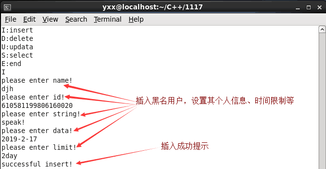

# ~~~~~~~~~~~~~项目概况 ~~~~~~~~~~~~~ #
## 1、项目名 ##
- 游客黑名单系统
## 2、运行环境 ##
- readhat6.2
- g++
- gdb
- libevent
- jsoncpp
- MySQL
- shell  
## 3、代码量 ##
- 1400左右
## 4、套接字监听工具 ##
- libevent
## 5、数据传输方式 ##
- tcp/ip
- jsoncpp
## 6、项目框架 ##
- 服务器端
	- 多线程
	- 分布式信息采集
	- 单利模式的Tcp连接
- 客户端
	- 半同步半异步线程池
	- 单利模式的全局队列
	- 继承和多态封装的MVC事务处理
	- 单利模式的数据库连接
	- 单利模式的TCP连接
## 7、项目简介 ##
此项目利用MVC模型将系统功能分层，利用TCP编程流程在服务器和客户端之间互相响应，利用Json打包处理数据，利用静态函数、单利模式控制某些单个实例，利用多线程提高系统处理时间效率，利用MySQL储存用户和黑名单人群的具体信息。在公共场所，针对出现不文明行为的人群进行限制。
## 8、部分功能演示 ##

## 9、收获 ##
- 对项目框架设计思想巩固
- 学习了MVC分层设计思想
- 对C++中类的使用更加熟练
- 学习了C++中单利模式
- 加深代码调试能力
- 巩固对链表增删查改操作

